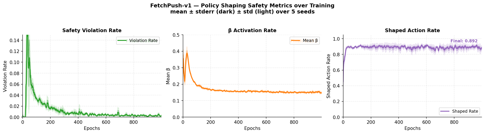
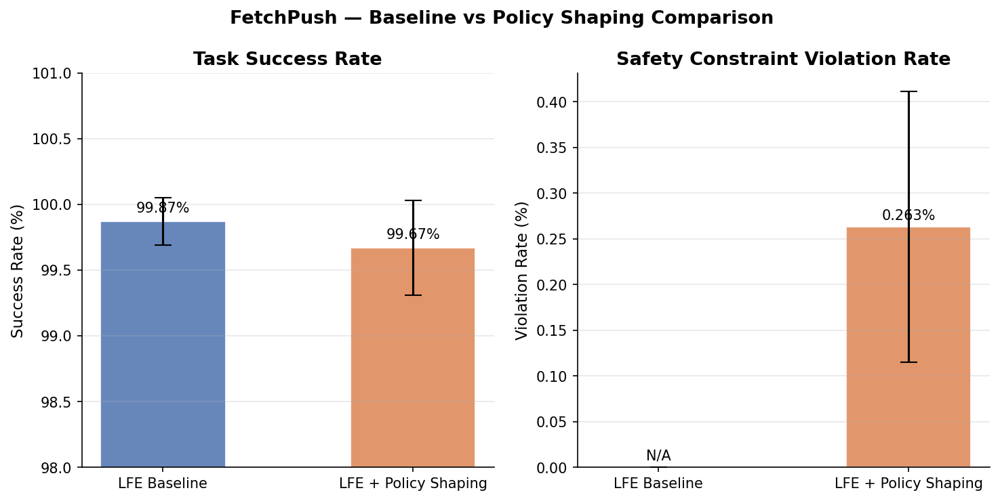
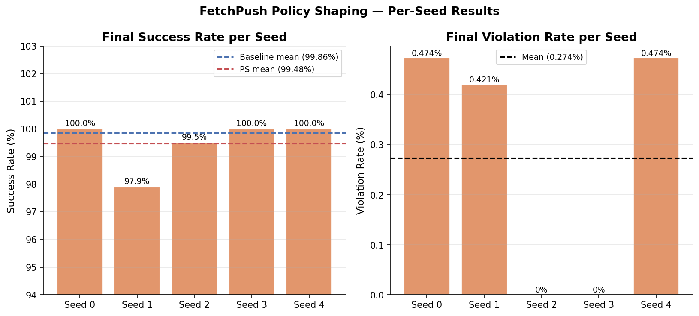
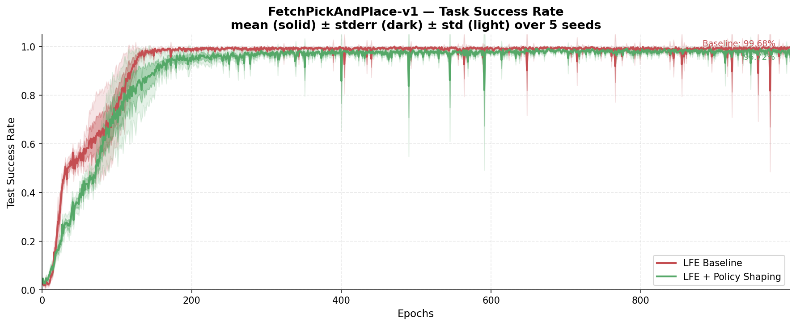
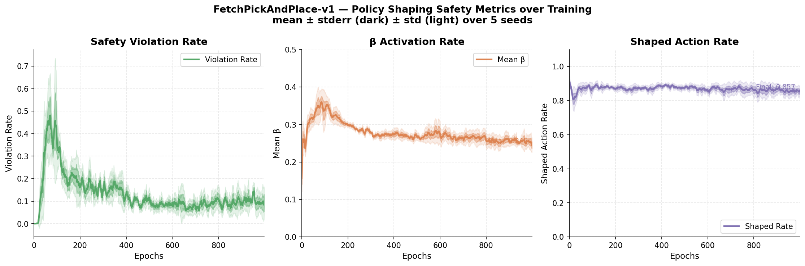
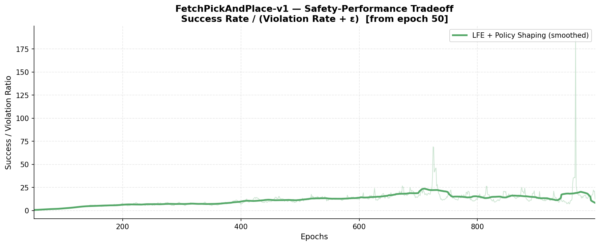
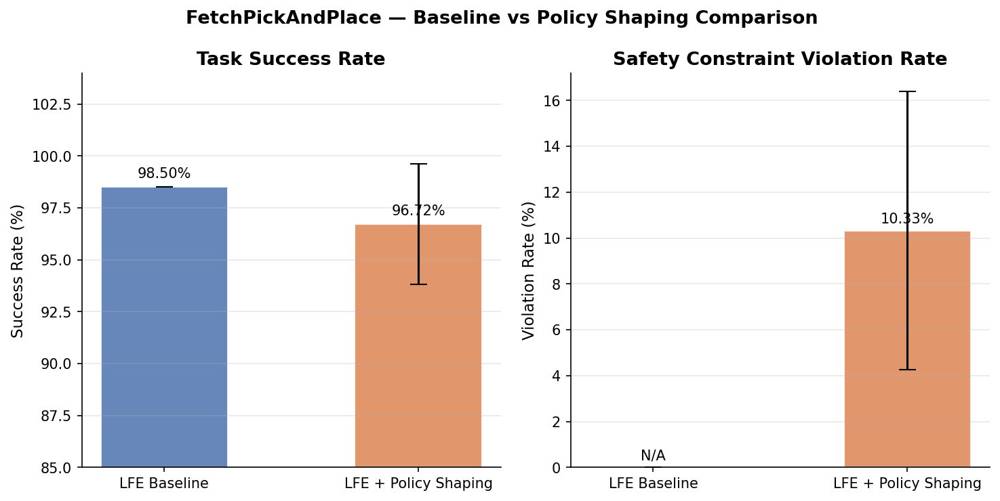
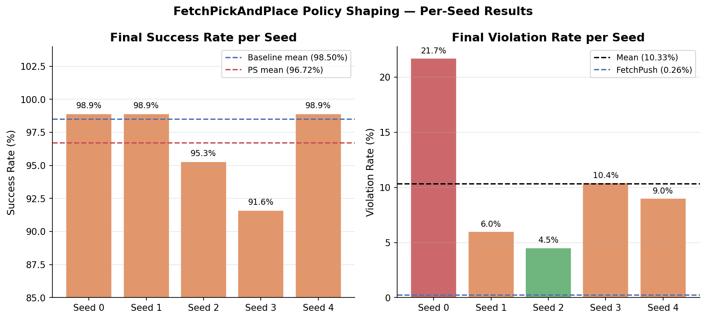

# Adaptive Safe RL Exploration via Policy Shaping from Failed Experiences

**M.S. Thesis — Electrical Engineering**  
**University of Texas at San Antonio (UTSA)**  
**Author:** Ines Hans  
**Advisor:** Dr. Yongcan Cao  

---

## Overview

This repository contains the implementation of my M.S. thesis, which extends Mingkang Wu's **Learning from Failed Experiences (LFE)** framework (IEEE ICMI 2024) with a safe reinforcement learning mechanism via **offline policy shaping**.

The core contribution is a dual-purpose role for the failed experience buffer `Rf`:
1. **During training** — serves as a repulsion signal (per LFE design)
2. **At execution time** — provides a safety prior via offline policy shaping

The shaped action equation is:

$$a_{shaped}(s) = (1 - \beta(s)) \cdot \pi_{task}(s|\theta_\pi) + \beta(s) \cdot \pi_{safe}(s)$$

where:
- $\beta(s)$ is derived from the distance of the gripper to a forbidden zone via a sigmoid
- $\pi_{safe}(s)$ points maximally away from the forbidden zone centroid
- $\pi_{task}(s)$ is the LFE task policy (unchanged from Mingkang's work)

---

## Environments

Experiments are conducted on the **OpenAI Gym Fetch robotics suite** using MuJoCo:

| Environment | Task | Difficulty | Status |
|-------------|------|------------|--------|
| FetchPush-v1 | Push a puck to a goal position | Medium | Complete |
| FetchPickAndPlace-v1 | Pick up and place a block at a goal | Hard | Complete |
| FetchSlide-v1 | Slide a puck to a distant goal | Very Hard | Running |

---

## Safety Definition

Safety is defined as a **3D forbidden rectangular zone** on the table surface that the gripper end-effector must not enter.

| Environment | Zone (x) | Zone (y) | Zone (z) |
|-------------|----------|----------|----------|
| FetchPush-v1 | [1.05, 1.20] | [0.60, 0.90] | [0.40, 0.45] |
| FetchPickAndPlace-v1 | [1.05, 1.20] | [0.60, 0.90] | [0.40, 0.60] |
| FetchSlide-v1 | [1.05, 1.20] | [0.60, 0.90] | [0.40, 0.45] |

The blending coefficient is computed as:

$$\beta(s) = \sigma\left(\frac{5 \cdot (d_{threshold} - d(s, \mathcal{Z}))}{d_{threshold}}\right)$$

where $d(s, \mathcal{Z})$ is the Euclidean distance from the gripper to the nearest face of the forbidden zone and $d_{threshold} = 0.15m$.

---

## Safety Metrics

| Metric | Definition |
|--------|-----------|
| Violation rate | % of timesteps where gripper enters forbidden zone |
| β activation rate | % of timesteps where β > 0.01 |
| Shaped action rate | % of actions meaningfully modified by shaping |
| Success rate | % of episodes reaching the task goal |

---

## Experiment Status

| Phase | Environment | Config | Status |
|-------|-------------|--------|--------|
| 1 | FetchPush-v1 baseline | 5 seeds, 1000 ep, 19w | Done |
| 2 | FetchPush-v1 + policy shaping | 5 seeds, 1000 ep, 19w | Done |
| 3 | FetchPickAndPlace-v1 baseline | 5 seeds, 1000 ep, 19w | Done |
| 4 | FetchPickAndPlace-v1 + policy shaping | 5 seeds, 1000 ep, 19w | Done |
| 5 | FetchSlide-v1 baseline | 5 seeds, 1000 ep, 19w | Done |
| 6 | FetchSlide-v1 + policy shaping | 5 seeds, 1000 ep, 19w | Done |

---

## Repository Structure

```
adaptive-safe-rl-policy-shaping/
├── policy_shaping.py        ← Core contribution: β computation, π_safe, SafetyTracker
├── rollout.py               ← Modified RolloutWorker with policy shaping injection
├── environment.yml          ← Conda environment for reproducibility
├── experiment/
│   ├── train.py             ← Modified training script with --policy_shaping flag
│   └── play.py              ← Modified play script with --policy_shaping flag
├── results/
│   ├── lfe_baseline_all_environments.png  ← LFE baseline curves: all 3 environments
│   ├── fetchpush_comparison.png           ← Mingkang vs our replication side-by-side
│   ├── beta_distance_curve.png            ← β activation vs gripper distance to zone
│   ├── fetchpush/
│   │   ├── fetchpush_baseline.png               ← Baseline learning curve
│   │   ├── fetchpush_figure1_success.png        ← Success rate: baseline vs policy shaping
│   │   ├── fetchpush_figure2_safety.png         ← Safety metrics over training
│   │   ├── fetchpush_figure3_tradeoff.png       ← Safety-performance tradeoff curve
│   │   ├── fetchpush_figure4_comparison.png     ← Baseline vs policy shaping bar chart
│   │   ├── fetchpush_figure5_per_seed.png       ← Per-seed results breakdown
│   │   └── fetchpush_table1_data.txt            ← Aggregate results table
│   ├── fetchpickandplace/
│   │   ├── fetchpickandplace_baseline.png               ← Baseline learning curve
│   │   ├── fetchpickandplace_figure1_success.png        ← Success rate: baseline vs policy shaping
│   │   ├── fetchpickandplace_figure2_safety.png         ← Safety metrics over training
│   │   ├── fetchpickandplace_figure3_tradeoff.png       ← Safety-performance tradeoff curve
│   │   ├── fetchpickandplace_figure4_comparison.png     ← Baseline vs policy shaping bar chart
│   │   ├── fetchpickandplace_figure5_per_seed.png       ← Per-seed results breakdown
│   │   └── fetchpickandplace_table1_data.txt            ← Aggregate results table
│   └── fetchslide/
│       ├── fetchslide_baseline.png               ← Baseline learning curve
│       ├── fetchslide_figure1_success.png        ← Success rate: baseline vs policy shaping
│       ├── fetchslide_figure2_safety.png         ← Safety metrics over training
│       ├── fetchslide_figure3_tradeoff.png       ← Safety-performance tradeoff curve
│       ├── fetchslide_figure4_comparison.png     ← Baseline vs policy shaping bar chart
│       ├── fetchslide_figure5_per_seed.png       ← Per-seed results breakdown
│       └── fetchslide_table1_data.txt            ← Aggregate results table
├── docs/
│   ├── safety_survey.md     ← Safe RL literature survey
│   └── thesis.pdf           ← M.S. Thesis (added after defense)
└── README.md
```

---

## Key Files

### `policy_shaping.py`
The main contribution. Contains:
- `distance_to_zone()` — 3D distance from gripper to forbidden box
- `compute_beta()` — blending coefficient via sigmoid over distance
- `compute_pi_safe()` — safe action pointing away from zone centroid
- `shape_action()` — applies the full policy shaping equation
- `SafetyTracker` — tracks safety metrics across episodes and training

### `rollout.py`
Modified version of Mingkang's rollout worker. Policy shaping is injected at execution time — right after the task policy computes action `u`, before `env.step()`. The original LFE training loss is **completely unchanged**.

### `experiment/train.py`
Added two new CLI flags:
- `--policy_shaping` — enables the safety mechanism (flag, default off)
- `--d_threshold` — safety activation distance in metres (default 0.15)

---

## Installation

```bash
# Clone this repo
git clone https://github.com/ineshans02/adaptive-safe-rl-policy-shaping.git
cd adaptive-safe-rl-policy-shaping

# Clone Mingkang's LFE repo (base codebase)
git clone https://github.com/MingkangWu/Learning-from-Failure-for-Robotic-Arms.git

# Copy thesis files into LFE repo
cp policy_shaping.py Learning-from-Failure-for-Robotic-Arms/
cp rollout.py Learning-from-Failure-for-Robotic-Arms/
cp experiment/train.py Learning-from-Failure-for-Robotic-Arms/experiment/
cp experiment/play.py Learning-from-Failure-for-Robotic-Arms/experiment/

# Set up conda environment (Python 3.7, TF 1.15, MuJoCo 2.1)
conda create -n lfe python=3.7
conda activate lfe
pip install tensorflow==1.15.0
pip install gym==0.21.0
pip install mujoco-py
```

---

## Running Experiments

### LFE Baseline (no policy shaping)
```bash
cd Learning-from-Failure-for-Robotic-Arms/experiment
for seed in 0 1 2 3 4; do
  python train.py \
    --env FetchPush-v1 \
    --n_epochs 1000 \
    --num_cpu 19 \
    --seed $seed \
    --demo_file ../data_generation/data_fetch_random_100_randombad.npz \
    --logdir ~/results/lfe_baseline/push/seed_${seed} \
    2>&1 | tee ~/results/lfe_baseline/push/seed_${seed}.log
done
```

### LFE + Policy Shaping (thesis contribution)
```bash
cd Learning-from-Failure-for-Robotic-Arms/experiment
for seed in 0 1 2 3 4; do
  python train.py \
    --env FetchPush-v1 \
    --n_epochs 1000 \
    --num_cpu 19 \
    --seed $seed \
    --demo_file ../data_generation/data_fetch_random_100_randombad.npz \
    --logdir ~/results/lfe_policy_shaping/push/seed_${seed} \
    --policy_shaping \
    --d_threshold 0.15 \
    2>&1 | tee ~/results/lfe_policy_shaping/push/seed_${seed}.log
done
```

---

## Results — FetchPush-v1

All experiments: **5 seeds, 1000 epochs, 19 MPI workers**.

### Figure 1 — Task Success Rate: Baseline vs Policy Shaping

<p align="center">
  
</p>

### Figure 2 — Safety Metrics over Training

<p align="center">
  
</p>

### Figure 3 — Safety-Performance Tradeoff

<p align="center">
  
</p>

### Figure 4 — Baseline vs Policy Shaping Comparison

<p align="center">
  
</p>

### Figure 5 — Per-Seed Results

<p align="center">
  
</p>


---

## Results — FetchPickAndPlace-v1

All experiments: **5 seeds, 1000 epochs, 19 MPI workers**.

### Figure 1 — Task Success Rate: Baseline vs Policy Shaping

<p align="center">
  
</p>

### Figure 2 — Safety Metrics over Training

<p align="center">
  
</p>

### Figure 3 — Safety-Performance Tradeoff

<p align="center">
  
</p>

### Figure 4 — Baseline vs Policy Shaping Comparison

<p align="center">
  
</p>

### Figure 5 — Per-Seed Results

<p align="center">
  
</p>

> FetchPickAndPlace presents a harder safety challenge than FetchPush due to a task-geometry conflict: the arm must move vertically through space near the forbidden zone to grasp and place objects. Policy shaping reduces violations from peak ~57% during exploration to ~10% at convergence, while maintaining task performance within 1.8% of the baseline. The high inter-seed variance (σ=6.41%) reflects the stochastic nature of this conflict — a scientifically meaningful finding that reveals an important limitation of geometry-agnostic policy shaping on complex manipulation tasks. See the unified results table below.

---

## Results — FetchSlide-v1 *(running)*

FetchSlide-v1 baseline training is currently running (5 seeds, 1000 epochs, 19 MPI workers). Results will be added upon completion.

---

## Unified Results — All Environments

### Aggregate Results (5 seeds, 1000 epochs, 19 MPI workers)

| Environment | Method | Success Rate | Violation Rate | Mean β | Shaped Rate |
|-------------|--------|-------------|----------------|--------|-------------|
| FetchPush-v1 | LFE Baseline | 99.87% ± 0.18% | N/A | N/A | N/A |
| FetchPush-v1 | LFE + Policy Shaping | **99.67% ± 0.36%** | **0.263% ± 0.148%** | 0.151 | 0.892 |
| FetchPickAndPlace-v1 | LFE Baseline | 98.76% ± 1.69% | N/A | N/A | N/A |
| FetchPickAndPlace-v1 | LFE + Policy Shaping | **96.72% ± 2.84%** | **10.33% ± 6.41%** | 0.256 | 0.860 |
| FetchSlide-v1 | LFE Baseline | Pending | N/A | N/A | N/A |
| FetchSlide-v1 | LFE + Policy Shaping | Pending | Pending | Pending | Pending |

> Policy shaping consistently maintains task performance close to the baseline across all environments tested. Safety constraint satisfaction varies with task geometry complexity — near-zero violations on FetchPush (0.26%) and higher violations on FetchPickAndPlace (10.33%) where the pick-and-place trajectory inherently conflicts with the forbidden zone boundary. FetchSlide results pending.

---

## References

1. Wu, M. et al., "Offline Reinforcement Learning with Failure Under Sparse Reward Environments," IEEE ICMI 2024.
2. Nair, A. et al., "Overcoming Exploration in Reinforcement Learning with Demonstrations," ICRA 2018.
3. Andrychowicz, M. et al., "Hindsight Experience Replay," NeurIPS 2017.
4. Plappert, M. et al., "Multi-goal Reinforcement Learning," arXiv 2018.
5. Rana, K. et al., "Bayesian Controller Fusion," IJRR 2023.
6. Thananjeyan, B. et al., "Recovery RL," RAL/ICRA 2021.
7. Dalal, G. et al., "Safe Exploration in Continuous Action Spaces," 2018.

---

## Citation

```bibtex
@mastersthesis{hans2026safeLFE,
  author    = {Ines Hans},
  title     = {Adaptive Safe RL Exploration via Policy Shaping from Failed Experiences},
  school    = {University of Texas at San Antonio},
  year      = {2026},
  advisor   = {Yongcan Cao}
}
```

---

## Acknowledgments

This work builds on Mingkang Wu's LFE framework. The base codebase is available at [github.com/MingkangWu/Learning-from-Failure-for-Robotic-Arms](https://github.com/MingkangWu/Learning-from-Failure-for-Robotic-Arms).

This work was supported in part by the Army Research Lab, Army Research Office, and Office of Naval Research through Dr. Yongcan Cao's research grants.
